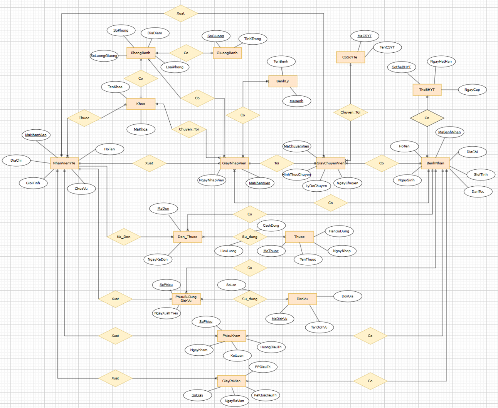

# Hệ Thống Quản Lý Bệnh Viện

Đây là dự án **Hệ Thống Quản Lý Bệnh Viện** được xây dựng bằng **Cơ sở dữ liệu Oracle**. Dự án được thực hiện với mục đích thực hành thiết kế cơ sở dữ liệu quan hệ, viết câu lệnh SQL và xử lý các bài toán quản lý bệnh viện thực tế.

---
🚩 **Lưu ý:**  
Dự án này được thực hiện cho mục đích **học tập**. Mọi dữ liệu, bảng biểu và tình huống chỉ mang tính **mô phỏng**, không phản ánh dữ liệu thực tế từ bất kỳ cơ sở y tế nào.  
Sinh viên tự xây dựng để thực hành thiết kế cơ sở dữ liệu, viết truy vấn SQL và quản lý dữ liệu.

---

## Mục tiêu dự án

Hệ thống hỗ trợ quản lý các thông tin cơ bản như:

- Bệnh nhân
- Nhân viên y tế
- Khoa khám chữa bệnh
- Thuốc, dịch vụ y tế
- Hồ sơ khám chữa bệnh, nhập viện, ra viện
- Phòng bệnh và giường bệnh

---

## Công nghệ sử dụng

- **Cơ sở dữ liệu:** Oracle
- **Ngôn ngữ:** SQL, PL/SQL
- **Công cụ:** Oracle SQL Developer (hoặc công cụ quản lý Oracle khác)

---

## Các bảng dữ liệu chính

Dưới đây là danh sách các bảng chính được thiết kế trong hệ thống:

| Tên Bảng | Các Trường |
|----------------|-------------------------|
| **BenhNhan** | MaBenhNhan, HoTen, NgaySinh, GioiTinh, DanToc, DiaChi |
| **Khoa** | MaKhoa, TenKhoa |
| **BenhLy** | MaBenh, TenBenh |
| **CoSoYTe** | MaCSYT, TenCSYT |
| **Thuoc** | MaThuoc, TenThuoc, NgayNhap, HanSuDung |
| **DonThuoc** | MaDon, NgayKeDon |
| **PhongBenh** | SoPhong, DiaDiem, LoaiPhong, SoLuongGiuong |
| **GiuongBenh** | SoGiuong, TinhTrang |
| **NhanVienYTe** | MaNhanVien, HoTen, GioiTinh, DiaChi, ChucVu |
| **TheBHYT** | SoTheBHYT, NgayCap, NgayHetHan |
| **GiayNhapVien** | MaNhapVien, NgayNhapVien |
| **DichVu** | MaDichVu, TenDichVu, DonGia |
| **PhieuKham** | SoPhieu, NgayKham, KetLuan, HuongDieuTri |
| **PhieuSuDungDichVu** | SoPhieu, NgayXuatPhieu |
| **GiayChuyenVien** | MaChuyenVien, HinhThucChuyen, LyDoChuyen, NgayChuyen |
| **GiayRaVien** | SoGiay, PPDieuTri, KetQuaDieuTri, NgayRaVien |

---

## Sơ đồ quan hệ (ERD)

> 

---

## Các chức năng chính

- Tạo bảng với ràng buộc khóa chính, khóa ngoại.
- Thêm, sửa, xoá thông tin bệnh nhân, nhân viên y tế.
- Quản lý thông tin nhập viện, ra viện, chuyển viện.
- Quản lý thuốc, kê đơn thuốc.
- Quản lý phòng bệnh, giường bệnh.
- Thực hiện các truy vấn SQL tổng hợp, báo cáo thống kê.

---

## Một số báo cáo trong dự án
Dưới đây là một số báo cáo dữ liệu được tạo ra từ hệ thống, nhằm minh hoạ cách truy vấn và trực quan hoá dữ liệu từ cơ sở dữ liệu.

### 1. Doanh thu dịch vụ theo năm

> Báo cáo thể hiện tổng doanh thu dịch vụ theo từng năm và từng tháng.

---

### 2. Tỉ lệ bệnh nhân nội trú và ngoại trú

> Biểu đồ tròn minh hoạ tỉ lệ bệnh nhân ngoại trú và bệnh nhân nhập viện.

---

### 3. Top dịch vụ được sử dụng nhiều nhất

> Báo cáo này liệt kê các dịch vụ có số lượt sử dụng cao nhất, giúp bệnh viện theo dõi và quản lý nguồn lực hiệu quả.

---

**Lưu ý:** Các số liệu trong báo cáo chỉ mang tính **mô phỏng**, phục vụ mục đích học tập, không phản ánh dữ liệu thật.
